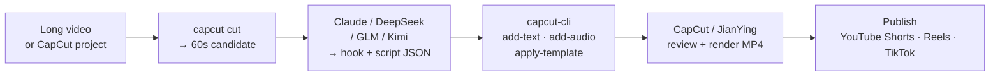

# capcut-cli

[](https://www.npmjs.com/package/capcut-cli)
[](https://www.npmjs.com/package/capcut-cli)
[](https://nodejs.org)
[](./LICENSE)

English | [中文](./README.zh-CN.md)

**The CapCut/JianYing toolkit that survives the next ByteDance update — and auto-captions with real caption objects.**

A pure CLI any LLM can drive: no MCP server, no HTTP daemon, no state. Inspect drafts, build from scratch, add media, modify subtitles, auto-caption with whisper, translate to N languages, cut long-form to shorts. Zero runtime deps, both CapCut and JianYing namespaces in one binary, JSON output by default.

**New in v0.4** — `caption` (whisper → real caption objects, not the import-srt text-mimics), `migrate` (mask ↔ common_masks across CapCut/JianYing version jumps), `lint` (schema-aware checks: overlaps, line length, missing files), `version` (detect support status), `translate` (Anthropic-API multi-language draft clone), `add-sfx`, `chroma`, `serve` (stateless JSONL queue runner for n8n/Coze/Make), and `export --batch` (EXPERIMENTAL macOS UI-automated render queue).

## v0.5 — vote on what ships next

Open for community vote on **[Discussion #1](https://github.com/renezander030/capcut-cli/discussions/1)**. 👍 the comments for the features you want most — I ship the top 3-5 as a single v0.5 release within ~2 weeks.

- ✅ `audio-fade <project> <id> --in <s> --fade-out <s>` — fade-in / fade-out on audio segments (proper `audio_fades` objects, not volume keyframes) **shipped in v0.5**
- ✅ `bubble-text <project> <id> --bubble <slug>` / 花字 — bubble / decorative text effects + `enums --bubbles` discovery **shipped in v0.5**
- ✅ `add-filter <project> <slug> <start> <duration>` + `enums --filters` — colour filter chain (separate from VFX/scene effects) **shipped in v0.5**
- ✅ `add-cover <project> <image-path>` / 封面 — set the JianYing/CapCut cover frame from the shell **shipped in v0.5**
- ✅ `import-ass <project> <ass-path>` — ASS subtitle import alongside existing `import-srt` **shipped in v0.5**
- ✅ `mix-mode <project> <id> <mode>` — blend modes per video segment (multiply, screen, overlay, …) **shipped in v0.5**

> Voting closes when v0.5 ships. If your feature is missing, drop a comment on Discussion #1.

## Workflow

How `capcut-cli` fits into a typical viral-shorts pipeline. Steps 2 and 3 are LLM-driven (any model that returns JSON); steps 1, 4, and 5 are deterministic CLI calls. Step 6 stays human — every short-video platform forbids automated upload, so the publish click is yours.



## Comparison

How `capcut-cli` differs from the other CapCut / JianYing tooling:

| Capability | [`pyJianYingDraft`](https://github.com/GuanYixuan/pyJianYingDraft) (Python, JianYing) | [`pyCapCut`](https://github.com/GuanYixuan/pyCapCut) (Python, CapCut) | [`CapCutAPI`](https://github.com/sun-guannan/CapCutAPI) (Python, HTTP server) | `cutcli` (Go, closed) | **`capcut-cli`** (Node, this repo) |
|---|:---:|:---:|:---:|:---:|:---:|
| Inspect drafts (`info` / `tracks` / `materials` / `segments` / `texts`) | partial | partial | ❌ | ❌ | ✅ |
| Create drafts from scratch | ✅ | ✅ | ✅ | ✅ | ✅ |
| Decorators (`keyframe` / `transition` / `mask` / `text-anim` / `image-anim`) | ✅ | ✅ | ✅ | ✅ | ✅ (v0.3.0) |
| SRT import → per-cue text segments | ❌ | ❌ | ✅ | ❌ | ✅ (v0.3.0) |
| Multi-style text (word-level highlight captions) | partial | partial | ❌ | ❌ | ✅ (v0.3.0) |
| Enum discovery for AI agents | ❌ | ❌ | partial | ❌ | ✅ — 13 categories × 2 namespaces |
| CapCut + JianYing namespaces in one binary | JianYing only | CapCut only | both | partial | both via `--jianying` |
| Templates (save/apply) | partial | partial | ❌ | ❌ | ✅ — 3 shipped templates |
| Schema docs | partial | partial | minimal | none | full ([`docs/draft-schema/`](./docs/draft-schema/)) |
| Wikimedia Commons URLs with license gate | ❌ | ❌ | ❌ | ❌ | ✅ (v0.3.0) |
| Runtime deps | several Python deps | several Python deps | Flask + Python | none (Go binary) | **zero** (Node ≥ 18 built-ins only) |
| AI-tool integration | none | none | HTTP | none | [Claude Code plugin](#claude-code-plugin) |
| Install | `pip install -r requirements.txt` | `pip install pyCapCut` | clone + run server | binary download | `npm install -g capcut-cli` |
| License | none | none | none | unclear | MIT |

## Feature checklist

Status of every feature shipped. ✅ = implemented, ⬜ = roadmap. Section anchors link to the relevant command docs further down.

### Project I/O
- ✅ [`init`](#create-build-projects-from-scratch) — create a new draft from scratch
- ✅ [`info`](#overview-start-here) · [`tracks`](#overview-start-here) · [`materials`](#overview-start-here) — overview
- ✅ [`segments`](#browse) · [`texts`](#browse) — list, filterable by track type
- ✅ [`segment` / `material` &lt;id&gt;](#detail-drill-into-one-item) — progressive disclosure for AI agents
- ✅ [`export-srt`](#browse) — dump captions to SRT
- ✅ [`cut`](#cut-long-form--short) — extract a time range into a standalone short

### Add content
- ✅ [`add-video`](#create-build-projects-from-scratch) · [`add-audio`](#create-build-projects-from-scratch) · [`add-text`](#add) — local files
- ✅ [`add-video`](#wikimedia-commons-phase-5) / [`add-audio`](#wikimedia-commons-phase-5) — Wikimedia Commons URLs with license gate
- ✅ [`add-sticker`](#decorators) — sticker track + transform
- ✅ [`add-effect`](#decorators) — scene effect on its own track (vhs, shake, cinematic, vignette, …)

### Edit
- ✅ [`set-text`](#edit) · [`shift`](#edit) · [`shift-all`](#edit) · [`speed`](#edit) · [`volume`](#edit) · [`opacity`](#edit) · [`trim`](#edit)
- ✅ [`batch`](#batch) — multiple edits, one JSON parse, one file write

### Decorators (v0.3.0)
- ✅ [`keyframe`](#decorators) — position, scale, rotation, alpha, colour-adjust, volume (single + `--batch` JSONL on stdin)
- ✅ [`transition`](#decorators) — 8 starter slugs + the full enum catalogue
- ✅ [`mask`](#decorators) — linear / mirror / circle / rectangle / heart / star + geometry flags + `--off`
- ✅ [`bg-blur`](#decorators) — levels 1–4 + `--off`
- ✅ [`text-style`](#decorators) — alpha · shadow · border · bg-box (26 flags)
- ✅ [`text-anim`](#decorators) · [`image-anim`](#decorators) — intro / outro / combo from CapCut's library
- ✅ [`text-ranges`](#decorators) — multi-style text, byte-accurate (unlocks word-level highlight captions)

### Templates
- ✅ [`save-template`](#templates) · [`apply-template`](#templates) — extract any segment as reusable JSON; restamp with new timing / position / text
- ✅ 3 templates ship in [`templates/`](./templates/): `gold-title`, `end-card`, `subscribe-cta`

### Import & discovery
- ✅ [`import-srt`](#import-srt-subtitles-phase-3) — one cue per text segment; file, stdin, or `--style-ref` mirror
- ✅ [`enums`](#enum-discovery-phase-3) — 12 categories × 2 namespaces from a committed `enums.json` (no network)

### Source materials
- ✅ Local files: mp4, mov, m4v, mp3, wav, aac, png, jpg, gif (any extension CapCut accepts)
- ✅ [Wikimedia Commons URLs](#wikimedia-commons-phase-5) — page URL, `/wiki/File:` URL, direct CDN URL, or `api.php?prop=pageimages` query. License classifier refuses restrictive without `--force-license`.

### Cross-platform
- ✅ CapCut **and** JianYing — same binary, `--jianying` flag switches the enum namespace
- ✅ macOS · Windows · Linux — pure Node ≥ 18, no native modules

### Output
- ✅ JSON (default — pipeable to `jq`)
- ✅ `-H` / `--human` table mode (human-readable)
- ✅ `-q` / `--quiet` mode (exit code only)

### Quality (v0.4)
- ✅ 60+ tests `node:test` suite ([`test/`](./test/)) running against [`test/draft_content.json`](./test/draft_content.json)
- ✅ Husky [pre-commit hook](./.husky/pre-commit) — Biome lint on staged files + full test run
- ✅ Schema reference in [`docs/draft-schema/`](./docs/draft-schema/) (7 files, ~3,700 lines)
- ✅ [Version support matrix](./docs/version-support.md) — tested CapCut/JianYing versions, known-broken set, encryption status
- ✅ [Claude Code plugin](#claude-code-plugin) (`/plugin marketplace add https://github.com/renezander030/capcut-cli`)

### Version resilience (v0.4)
- ✅ `version` — detect CapCut/JianYing version + schema flags (`mask_field`, `text_ranges`, `audio_fades`) + support status
- ✅ `lint` — schema-aware checks: caption overlaps (error), line length, cue duration, missing material refs, missing local files. Exit codes 0/1/2 for CI
- ✅ `migrate` — apply known migrations (`mask` ↔ `common_masks` across the JianYing 5.9 / CapCut 9.6 boundary)
- ✅ `decrypt` — JianYing 6.0+ encryption detection + clear workaround UX (decryption algorithm intentionally not bundled)

### Captions & translation (v0.4)
- ✅ `caption` — whisper shell-out (openai-whisper / whisper.cpp / faster-whisper) → real caption-track segments with `sub_type` + `caption_template_info` (addresses pyJianYingDraft #148 — no more text-segment mimics)
- ✅ `translate` — Anthropic-API multi-language draft clone, zero runtime deps (uses built-in `fetch`). `--dry-run` for safe inspection. Original stays untouched

### v0.5 — new commands (in progress)
- ✅ `mix-mode` — set blend mode on a video segment (normal · multiply · screen · overlay · soft-light · hard-light · color-dodge · color-burn · darken · lighten · difference · exclusion)
- ✅ `audio-fade` — fade-in / fade-out on an audio segment via `materials.audio_fades[]` (real fade material, not `volume` keyframes)
- ✅ `add-cover` — set the draft's cover frame (thumbnail) to a local image (PNG/JPG); `--time <ms>` defaults to 0
- ✅ `add-filter` — colour-filter track separate from `add-effect`; 10-slug starter catalogue (capcut) or 468 slugs via `enums --filters --jianying`
- ✅ `bubble-text` — speech-bubble shape on a text segment (7-slug starter catalogue + `enums --bubbles`, or `--effect-id`/`--resource-id` for your own ids)
- ✅ `import-ass` — ASS / SSA subtitle import alongside `import-srt`; shares `--track-name` / `--style-ref` / `--time-offset` and the full text-style flag set

### Ecosystem unlocks (v0.4)
- ✅ `add-sfx` — first-class sound effects on a dedicated track (15+ CapCut SFX slugs via `enums --audio-effects`)
- ✅ `chroma` — green-screen / chroma key on video segments (`--color` + `--intensity`, or `--off`)
- ✅ `serve` — stateless JSONL queue runner (read from stdin or `--queue` file, dispatch to existing CLI, write JSONL results). No daemon, no port, no shared state — unlocks n8n / Coze / Make / cron without becoming a service
- ✅ `export --batch` — EXPERIMENTAL UI-automated render queue (macOS AppleScript; Windows path sketched). `--dry-run` for safe exploration on any OS

### Roadmap
- ⬜ Drag-and-drop GIF demos in this README
- ⬜ JianYing 6.0+ decryption (currently only detection — see `decrypt` workaround docs)
- ⬜ Windows path for `export --batch` (currently only macOS via AppleScript)
- 🚫 HTTP server / cloud rendering / MCP server — explicitly out of scope per [`PLAN.md`](./PLAN.md). `serve` ships as a stateless JSONL runner instead — no port, no daemon.

## The problem

CapCut stores projects as `draft_content.json` -- deeply nested, undocumented, with timing in microseconds and text buried inside escaped JSON-in-JSON. Every manual edit means: find the right segment ID, trace it to the material, figure out the content format, convert your timestamp, edit, pray you didn't break the structure. **15 seconds per change**, minimum.

`capcut-cli` already knows the schema. One command, one change, **5 seconds**.

```
$ capcut texts ./project
[{"id":"a1b2c3d4-...","start_us":500000,"duration_us":2500000,"text":"Welcome to the video"}]

$ capcut set-text ./project a1b2c3 "Fixed subtitle"
{"ok":true,"id":"a1b2c3d4-...","old":"Welcome to the video","new":"Fixed subtitle"}
```

Zero dependencies. JSON output by default. Pipeable. Works with CapCut and JianYing.

## Install

```bash
npm install -g capcut-cli
```

Or run directly:
```bash
npx capcut-cli info ./my-project/
```

### Claude Code plugin

Add the marketplace, then enable the plugin:

```
/plugin marketplace add https://github.com/renezander030/capcut-cli
/plugin enable capcut-cli
```

This gives Claude Code the `/capcut-cli:capcut-edit` skill -- it learns every command, the progressive disclosure navigation pattern, and how to find your CapCut projects on macOS/Windows. Auto-installs the CLI on first enable.

### Why a CLI, not an MCP server

Other CapCut / JianYing tooling exposes an HTTP API or MCP server. `capcut-cli` deliberately does not:

- **No state to corrupt.** Each command is JSON-in, JSON-out. The agent can interleave commands, retry safely, and exit any time. Versioning is `npm install -g capcut-cli@x.y.z`.
- **No second tool to install.** If the user has Node ≥ 18 they already have the runtime; `npx capcut-cli` works without a global install. No daemon, no port, no auth surface.
- **Works in every agent surface.** Claude Code via the [plugin](#claude-code-plugin) — also `bash`, `make`, GitHub Actions, cron, any wrapper that can `exec`. MCP ties you to one host; a CLI runs anywhere `sh` runs.

The tradeoff is live streams — no progress events, no long-running render. That's intentional: every short-video platform requires a human render-and-publish step regardless (see [`PLAN.md`](./PLAN.md)).

### Drive it from an LLM

Real transcript — Claude Code with the `capcut-cli` plugin, no server in the loop:

```text
> Cut a 30-second teaser from this project starting at the climax around 4:12, add a hook title.

I'll inspect first.

→ capcut info ./project
{ "duration_us": 612000000, "segments": 24, "materials": 18 }

→ capcut segments ./project --track video
[{"id":"f1e2d3...","start_us":252000000,"duration_us":48000000,"speed":1.0}, ...]

Climax runs 4:12 → 5:00. Cutting a 30-second window centered there.

→ capcut cut ./project 4:00 4:30 --out ./teaser.json
{ "ok": true, "out": "./teaser.json", "duration_us": 30000000, "segments": 4 }

→ capcut add-text ./teaser.json 0s 3s "WAIT FOR IT" --font-size 28 --color "#FFD700"
{ "ok": true, "id": "a1b2c3...", "track": "text" }

Teaser ready at ./teaser.json. Open in CapCut to review and render.
```

The agent navigates `info → segments → cut → add-text` without holding any state. **The CLI is the protocol** — no second-tier server to maintain, version, or authenticate against.

## Output modes

**JSON (default)** -- pipe to `jq`, feed to scripts, consume from agents:
```bash
capcut texts ./project | jq '.[].text'
capcut info ./project | jq '.duration_us'
```

**Human-readable** (`-H` / `--human`):
```bash
capcut texts ./project -H
ID        Start   -End       Text
a1b2c3d4  0:00.50- 0:03.00   Welcome to the video
```

**Quiet** (`-q` / `--quiet`) -- exit code only, zero stdout on writes:
```bash
capcut set-text ./project a1b2c3 "New text" -q && echo "done"
```

## Commands

### Overview (start here)

```bash
capcut info ./project                        # Project overview + material summary
capcut tracks ./project                      # List all tracks
capcut materials ./project                   # List all material types + counts
capcut materials ./project --type audios     # List items of one material type
```

### Browse

```bash
capcut segments ./project                    # List all segments with timing
capcut segments ./project --track text       # Filter by track type
capcut texts ./project                       # List all text/subtitle content
capcut export-srt ./project > subs.srt       # Export subtitles to SRT
```

### Detail (drill into one item)

```bash
capcut segment ./project a1b2c3              # Full detail for one segment + its material
capcut material ./project a1b2c3             # Full detail for one material
```

Progressive disclosure: `info` shows the shape, `materials` shows what's available, `segment`/`material` shows everything about one item. An AI agent navigates overview → list → detail, never gets more data than it needs.

### Create (build projects from scratch)

No need to open CapCut first. Create a draft, add media, then open in CapCut.

```bash
# Create an empty draft
capcut init "My Short" --drafts ~/Movies/CapCut/User\ Data/Projects/com.lveditor.draft

# Add media
capcut add-video ./my-short ./clip.mp4 0s 10s
capcut add-audio ./my-short ./voiceover.wav 0s 10s --volume 0.9
capcut add-audio ./my-short ./music.mp3 0s 30s --volume 0.3

# Add titles
capcut add-text ./my-short 0s 5s "My Short" --font-size 24 --color "#FFD700"
```

`init` creates a valid `draft_content.json` from a built-in template. `add-video` and `add-audio` copy the file into the draft's assets directory so CapCut can find it. Open the project in CapCut and everything links up.

Options for `add-video` / `add-audio`: `--volume <0-1>`, `--template <path>` (custom draft template).

### Add

```bash
capcut add-text ./project 0s 5s "Title" --font-size 24 --color "#FFD700" --y -0.4
capcut add-text ./project 55s 5s "Subscribe!" --font-size 14 --align 1
```

Options: `--font-size <n>`, `--color <hex>`, `--align <0|1|2>` (left/center/right), `--x <n> --y <n>` (position, -1 to 1), `--track-name <name>`.

### Edit

Every write command creates a `.bak` backup before modifying the file.

```bash
capcut set-text ./project a1b2c3 "New subtitle"
capcut shift ./project a1b2c3 +0.5s
capcut shift ./project a1b2c3 -200ms
capcut shift-all ./project +1s
capcut shift-all ./project -0.5s --track text
capcut speed ./project a1b2c3 1.5
capcut volume ./project a1b2c3 0.8
capcut opacity ./project a1b2c3 0.5
capcut trim ./project a1b2c3 2s 5s
```

### Templates

Extract any element from a project as a reusable template, then stamp it into other projects. Works with text, stickers, shapes, video, audio -- anything that exists as a segment.

```bash
# Save a styled text element as a template
capcut save-template ./project a1b2c3 "gold-title" --out gold-title.json

# Apply it to another project with new timing
capcut apply-template ./other-project gold-title.json 0s 5s

# Override the text content (keeps all styling -- font, color, size)
capcut apply-template ./project gold-title.json 5:00 4s "Chapter 3: The Forge"

# Save a sticker and reuse it
capcut save-template ./project d4e5f6 "subscribe-btn" --out subscribe.json
capcut apply-template ./project subscribe.json 9:50 5s --x 0.35 --y -0.35
```

Templates preserve everything: styling, colors, font size, scale, resource IDs, shadow settings, shape params. Only the ID, timing, and optionally position/text get changed on apply.

**Workflow: build a template library**

```bash
# Create elements in CapCut, then extract them
mkdir -p ~/.capcut-templates
capcut save-template ./project abc123 "lower-third"   --out ~/.capcut-templates/lower-third.json
capcut save-template ./project def456 "end-card"      --out ~/.capcut-templates/end-card.json
capcut save-template ./project ghi789 "subscribe-cta" --out ~/.capcut-templates/subscribe-cta.json

# Stamp them into every new project
capcut apply-template ./new-project ~/.capcut-templates/lower-third.json 0s 5s "New Episode"
capcut apply-template ./new-project ~/.capcut-templates/end-card.json 9:55 5s
capcut apply-template ./new-project ~/.capcut-templates/subscribe-cta.json 9:50 5s
```

### Decorators

Phase 1 / 2 / 4 — write to materials on existing segments:

```bash
capcut keyframe    ./project a1b2c3 uniform_scale 0s 1.0
capcut keyframe    ./project a1b2c3 uniform_scale 3s 1.2
capcut transition  ./project a1b2c3 dissolve --duration 0.4s
capcut mask        ./project a1b2c3 heart --size 0.6 --feather 20
capcut bg-blur     ./project a1b2c3 2
capcut text-style  ./project c1c1c1 --shadow --border-width 0.1 --border-color "#000000"
capcut text-anim   ./project c1c1c1 --intro typewriter --outro fade-out
capcut image-anim  ./project a1b2c3 --intro fade-in --outro fade-out
capcut add-sticker ./project 7089817320127663629 2s 4s --x 0.3 --y -0.3
capcut add-effect  ./project vhs 0s 5s --params '[80]'
capcut text-ranges ./project c1c1c1 --styles '[
  {"start":0,"end":5,"font_color":"#FFD700","bold":true},
  {"start":6,"end":14,"font_color":"#FFFFFF"}
]'
```

See `skills/capcut-edit/references/api-reference.md` for every flag and value
format.

### Enum discovery (Phase 3)

```bash
capcut enums --transitions -H           # 116 CapCut transitions
capcut enums --masks                    # JSON
capcut enums --scene-effects --jianying # switch namespace (912 slugs)
capcut enums --text-intros | jq '.[] | select(.slug | startswith("fade"))'
```

Categories: `--transitions`, `--masks`, `--image-intros`, `--image-outros`,
`--image-combos`, `--text-intros`, `--text-outros`, `--text-loop-anims`,
`--scene-effects`, `--character-effects`, `--audio-effects`, `--fonts`.

### Wikimedia Commons (Phase 5)

`add-video` and `add-audio` accept a Wikimedia URL anywhere they accept a file
path. The CLI fetches through the Commons imageinfo API, license-checks, and
streams the file into the draft's assets dir.

```bash
# pageimages API — the official "give me the image for this page" call
capcut add-video ./project \
  "https://en.wikipedia.org/w/api.php?action=query&titles=Barcelona&prop=pageimages&piprop=original&format=json" \
  0s 5s

# /wiki/File: page
capcut add-audio ./project \
  "https://commons.wikimedia.org/wiki/File:Wind_and_rain.ogg" \
  0s 30s

# Direct CDN (still license-checks)
capcut add-video ./project \
  "https://upload.wikimedia.org/wikipedia/commons/a/ab/Some_image.jpg" \
  5s 5s

# Bypass refusal on restrictive/unknown license (you take responsibility)
capcut add-video ./project "https://en.wikipedia.org/wiki/File:Copyright_logo.svg" 10s 3s --force-license
```

Output JSON includes a `wikimedia` block: `file_title`, `license`,
`license_class` (permissive / fair-use / restrictive / unknown), `artist`,
`credit`, `description_url`, `width`, `height`, `mime`. **Attribution the
CC-BY family requires** — use `artist` + `description_url` in your YouTube
description.

Non-Wikimedia HTTPS URLs are refused before any network call. Download
separately and pass a local path.

### Import SRT subtitles (Phase 3)

```bash
# From a file — one text segment per cue on a "captions" track
capcut import-srt ./project subs.srt --track-name captions --time-offset -120ms

# From stdin (Whisper output, etc.)
faster-whisper --output-format srt < audio.wav \
  | capcut import-srt ./project - --style-ref c1c1c1
```

`--style-ref <seg-id>` mirrors font/color/shadow/border/background from an
existing text segment onto every new cue.

### Cut (long-form → short)

Extract a time range from a project into a new file. Clips edge segments, rebases timing to zero, removes empty tracks, cleans up orphaned materials.

```bash
# 60-second teaser from a 10-minute video
capcut cut ./project 1:00 2:00 --out ./teaser.json

# 30-second highlight
capcut cut ./project 3:00 3:30 --out ./highlight.json

# Then add titles to the short
capcut add-text ./teaser.json 0s 5s "MYCENAE" --font-size 24 --color "#FFD700"
capcut add-text ./teaser.json 55s 5s "Full video in description" --font-size 14
```

> **Cutting long-form into viral Shorts is what I built this for.** The full pipeline — picking the right 60-second story, writing hooks that hold attention, the Claude skill that orchestrates `capcut-cli` end-to-end — is the [Viral Story Shorts Blueprint](https://renezander.gumroad.com/l/viral-youtube-shorts-blueprint?utm_source=capcut-cli&utm_medium=readme&utm_campaign=cut-section).

### Batch

Multiple edits, one JSON parse, one file write:

```bash
echo '{"cmd":"set-text","id":"a1b2c3","text":"Line one"}
{"cmd":"set-text","id":"d4e5f6","text":"Line two"}
{"cmd":"shift","id":"a1b2c3","offset":"+0.3s"}
{"cmd":"volume","id":"g7h8i9","volume":0.5}' | capcut batch ./project
```

Output: `{"ok":true,"succeeded":4,"failed":0}`

Batch tolerates per-operation errors and continues processing. Operations: `set-text`, `shift`, `shift-all`, `speed`, `volume`, `opacity`, `trim`.

### IDs

Segment and material IDs are UUIDs. The first 6-8 characters work as prefix match:

```bash
$ capcut texts ./project | jq '.[0].id'
"a1b2c3d4-0000-0000-0000-000000000001"

$ capcut set-text ./project a1b2c3 "Hey everyone"
{"ok":true,"id":"a1b2c3d4-0000-0000-0000-000000000001","old":"Welcome","new":"Hey everyone"}
```

### Time formats

- `1.5s` -- 1.5 seconds
- `500ms` -- 500 milliseconds
- `+0.5s` / `-1s` -- relative offset
- `1:30` -- 1 minute 30 seconds
- `0:05.5` -- 5.5 seconds

## How it works

CapCut stores projects as JSON (`draft_content.json` on Windows, `draft_info.json` on macOS). This CLI reads and modifies that JSON directly. It preserves the original file's indentation style on save.

Typical project location:
- **Windows**: `C:\Users\<you>\AppData\Local\CapCut\User Data\Projects\com.lveditor.draft\<id>\`
- **macOS**: `/Users/<you>/Movies/CapCut/User Data/Projects/com.lveditor.draft/<id>/`

Close the project in CapCut before editing, reopen after. CapCut reads the JSON on project open.

## Workflow: batch subtitle correction

```bash
# Get all subtitle IDs and text
capcut texts ./project | jq '.[] | "\(.id) \(.text)"'

# Fix 3 typos + sync timing in one shot
echo '{"cmd":"set-text","id":"a1b2c3","text":"Corrected line one"}
{"cmd":"set-text","id":"d4e5f6","text":"Corrected line two"}
{"cmd":"set-text","id":"g7h8i9","text":"Corrected line three"}
{"cmd":"shift-all","offset":"+0.3s","track":"text"}' | capcut batch ./project
```

Four changes, one file write. Done in under 5 seconds.

## Examples

End-to-end recipes in [`examples/`](./examples/):

- [Cut one long video into multiple shorts](./examples/cut-to-shorts.md)
- [Batch-fix subtitles (typos + timing in one pass)](./examples/batch-fix-subtitles.md)
- [Build a short from scratch — clip + VO + music + title, no GUI](./examples/build-short-from-scratch.md)
- [Translate subtitles via SRT round-trip](./examples/translate-subtitles.md)
- [Save a styled title once, reuse across many projects](./examples/reusable-title-template.md)
- [Programmatic Ken Burns zoom keyframes](./examples/keyframe-zoom.md)
- [Unfinished-pan keyframe pattern for epilogue stills](./examples/keyframe-pan.md)
- [Pre-flight check on VO + word-level timestamps](./examples/verify-vo-alignment.md)

## What's next

- **Want the full viral-shorts system, not just the CLI?** Get the [Viral Story Shorts Blueprint + Claude Skill](https://renezander.gumroad.com/l/viral-youtube-shorts-blueprint?utm_source=capcut-cli&utm_medium=readme&utm_campaign=footer) — the complete pipeline I use to ship Shorts at volume.
- **By the same author**: [draftyard](https://github.com/renezander030/draftyard) — governed AI pipelines for service businesses (Go, MIT). Same design DNA: single binary, no API needed, structured JSON boundary between agent and tool.
- **Author**: I'm Rene Zander — I build AI-driven content automation systems. More guides at [renezander.com](https://renezander.com/?utm_source=capcut-cli&utm_medium=readme&utm_campaign=author).
- **Hire me** for AI/automation work: [renezander.com/contact](https://renezander.com/contact/?utm_source=capcut-cli&utm_medium=readme&utm_campaign=hire).

## License

MIT
