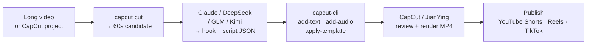

<p align="center">
  
</p>

# capcut-cli

[](https://github.com/renezander030/capcut-cli/actions/workflows/ci.yml)
[](https://www.npmjs.com/package/capcut-cli)
[](https://www.npmjs.com/package/capcut-cli)
[](https://nodejs.org)
[](./LICENSE)

English | [中文](./README.zh-CN.md)

> **Disclaimer:** This is an independent, community-maintained project. It is **not affiliated with, sponsored by, or endorsed by** CapCut, JianYing, or ByteDance Ltd. "CapCut" and "JianYing" (剪映) are trademarks of ByteDance Ltd. All product names, logos, and brands are the property of their respective owners and are used here only for identification (nominative) purposes.

_An independent, community-maintained CLI for CapCut / JianYing draft files._

**An independent CLI for CapCut / JianYing that any LLM agent can drive — zero dependencies, no server, both namespaces in one binary.**

Every command uses a version-aware local draft store: JSON in, JSON out, no MCP server or HTTP daemon. On newer CapCut versions it detects and synchronizes every readable timeline target instead of assuming `draft_content.json` is the only source of truth. That gives any model (Claude, DeepSeek, GLM, Kimi) a deterministic pipeline boundary for inspection, building, subtitles, captions, translation, and long-form cuts.

**Use it three ways:**

- **CLI** — `npm install -g capcut-cli`, then `capcut <command> <project>`
- **Library** — `import { loadDraft, lintDraft, saveDraft } from "capcut-cli"` (typed, zero-dep)
- **Queue runner** — `capcut serve` reads JSONL jobs from stdin and drops into [n8n / Make / Coze](./examples/serve-automation.md)

Run `capcut doctor` first to verify Node, whisper, ffprobe/FFmpeg capabilities, and draft directories.

See the [changelog](./CHANGELOG.md) and [releases](https://github.com/renezander030/capcut-cli/releases) for what's new in each version.

**Current release: v0.11.3.** The v0.11 line adds CapCut 8.7 multi-file storage, atomic/conflict-safe writes, transactional batch, command-schema v2, compile v2, karaoke captions, full media probing, multi-track proxy composition, and a concurrent retrying automation runner. v0.11.2 fixed Windows drive-letter paths across `init`, `compile`, `serve`, ESM consumers, and exact-byte restore; v0.11.3 synchronizes the English and Chinese documentation. See the [v0.11.3 release](https://github.com/renezander030/capcut-cli/releases/tag/v0.11.3).

## Workflow

How `capcut-cli` fits into a typical viral-shorts pipeline. Steps 2 and 3 are LLM-driven (any model that returns JSON); steps 1, 4, and 5 are deterministic CLI calls. Step 6 stays human — every short-video platform forbids automated upload, so the publish click is yours.



## Comparison

How `capcut-cli` differs from the other CapCut / JianYing tooling:

| Capability | [`pyJianYingDraft`](https://github.com/GuanYixuan/pyJianYingDraft) (Python, JianYing) | [`pyCapCut`](https://github.com/GuanYixuan/pyCapCut) (Python, CapCut) | [`VectCutAPI`](https://github.com/sun-guannan/VectCutAPI) (Python, HTTP server, formerly CapCutAPI) | `cutcli` (Go, closed) | **`capcut-cli`** (Node, this repo) |
|---|:---:|:---:|:---:|:---:|:---:|
| Inspect drafts (`info` / `tracks` / `materials` / `segments` / `texts`) | partial | partial | ❌ | ❌ | ✅ |
| Create drafts from scratch | ✅ | ✅ | ✅ | ✅ | ✅ |
| Declarative spec → draft (one `compile`, not 30 imperative calls) | ❌ | ❌ | ❌ | ❌ | ✅ (v0.10.0) |
| Preview an edit without opening CapCut (local ffmpeg proxy) | ❌ | ❌ | ❌ | ❌ | ✅ (v0.10.0) |
| Decorators (`keyframe` / `transition` / `mask` / `text-anim` / `image-anim`) | ✅ | ✅ | ✅ | ✅ | ✅ (v0.3.0) |
| SRT import → per-cue text segments | ❌ | ❌ | ✅ | ❌ | ✅ (v0.3.0) |
| Multi-style text (word-level highlight captions) | partial | partial | ❌ | ❌ | ✅ (v0.3.0) |
| Enum discovery for AI agents | ❌ | ❌ | partial | ❌ | ✅ — 13 categories × 2 namespaces |
| CapCut + JianYing namespaces in one binary | JianYing only | CapCut only | both | partial | both via `--jianying` |
| Templates (save/apply) | partial | partial | ❌ | ❌ | ✅ — 6 shipped templates |
| Schema docs | partial | partial | minimal | none | full ([`docs/draft-schema/`](./docs/draft-schema/)) |
| Wikimedia Commons URLs with license gate | ❌ | ❌ | ❌ | ❌ | ✅ (v0.3.0) |
| Runtime deps | several Python deps | several Python deps | Flask + Python | none (Go binary) | **zero** (Node ≥ 18 built-ins only) |
| AI-tool integration | none | none | HTTP | none | [Claude Code plugin](#claude-code-plugin) |
| Install | `pip install -r requirements.txt` | `pip install pyCapCut` | clone + run server | binary download | `npm install -g capcut-cli` |
| License | none | none | none | unclear | MIT |

## What it does

A capability map; see [Commands](#commands) for syntax.

- **Inspect** — `info` · `tracks` · `materials` · `segments` · `texts`; `segment`/`material <id>` for progressive-disclosure drill-down; `timeline` (ASCII layout); `export-srt`.
- **Preview** — `render` builds a low-res **ffmpeg proxy** of the timeline (trim + speed + audio fades, styled captions, optional `--all-video-tracks`) so you can watch an edit without opening CapCut. A preview, not CapCut's final render; `--dry-run` prints the ffmpeg plan.
- **Build & add** — `init` a draft or use `compile` v2 with refs, decorators, templates, captions, and `--check`/`--plan`; then `add-video` · `add-audio` · `add-text` from local files or [Wikimedia Commons URLs](#wikimedia-commons-phase-5). Media duration/dimensions are auto-probed when ffprobe is present.
- **Edit** — `set-text` · `shift` · `shift-all` · `speed` · `volume` · `opacity` · `trim`; `batch` (many edits, one write); `--dry-run` preview, and `restore` undo (latest `.bak` or `--step N` through snapshot history).
- **Maintain & compose** — `prune` (drop unreferenced materials) · `relink` (repair broken media paths via `--dir` or `--from`/`--to`) · `projects` (list drafts on disk by name) · `diff` (compare two drafts) · `concat` (stitch drafts into one timeline, id-safe).
- **Decorate** — `keyframe` · `transition` · `mask` · `bg-blur` · `text-style` · `text-anim` · `image-anim` · `text-ranges` (word-level highlight captions); `mix-mode` · `audio-fade` · `add-filter` · `bubble-text` · `add-cover` · `add-sfx` · `chroma`.
- **Captions & translate** — `caption` supports OpenAI Whisper, whisper.cpp, and faster-whisper plus word-timestamp `--karaoke`; `import-srt` / `import-ass`; `translate` (Anthropic-API multi-language clone).
- **Templates** — `save-template` / `apply-template`; six ship in [`templates/`](./templates/) (`gold-title`, `end-card`, `subscribe-cta`, `hook-question`, `lower-third`, `caption-pop`).
- **Resilience** — `diagnose` (canonical storage/divergence report) · atomic synchronized writes · conflict/editor guards · `version` · `lint` · `migrate` · `decrypt`; [schema reference](./docs/draft-schema/) + [version matrix](./docs/version-support.md).
- **Discover** — `enums` — 13 categories × 2 namespaces, no network.
- **Integrate** — `describe` command-contract v2, typed `runCommand()` [library](#use-as-a-node-library), generated [command reference](./docs/command-reference.md), [Dockerfile](./Dockerfile), [GitHub Action](#github-action--lint-drafts-in-ci), concurrent/retrying `serve`, `export --batch`, completions, and the [Claude Code plugin](#claude-code-plugin).
- **Output** — JSON by default (pipe to `jq`), `-H` table, `-q` quiet. Defaults (`drafts` dir, `jianying`, `cols`) can live in a `.capcutrc`; `capcut config` shows the resolved values.

**Cross-platform:** CapCut **and** JianYing in one binary (`--jianying` switches the enum namespace); macOS · Windows · Linux; pure Node ≥ 18, zero runtime deps.

**Verified:** 205 `node:test` checks; Node 18/20/22 on Linux; and the complete Node 20 suite on Ubuntu, macOS, and Windows in GitHub Actions.

### Roadmap
- ⬜ Validate the v0.11 CapCut 8.7 storage adapter against a reporter-provided Windows project bundle and close [#35](https://github.com/renezander030/capcut-cli/issues/35).
- ⬜ JianYing 6.0+ decryption (currently detection and workaround guidance only).
- 🚫 HTTP server / cloud rendering / MCP server — out of scope per [`PLAN.md`](./PLAN.md); `serve` is a stateless JSONL runner instead. Vote on what lands next in [Discussion #1](https://github.com/renezander030/capcut-cli/discussions/1).

## The problem

CapCut stores projects as `draft_content.json` -- deeply nested, undocumented, with timing in microseconds and text buried inside escaped JSON-in-JSON. Every manual edit means: find the right segment ID, trace it to the material, figure out the content format, convert your timestamp, edit, pray you didn't break the structure. **15 seconds per change**, minimum.

`capcut-cli` already knows the schema. One command, one change, **5 seconds**.

```
$ capcut texts ./project
[{"id":"a1b2c3d4-...","start_us":500000,"duration_us":2500000,"text":"Welcome to the video"}]

$ capcut set-text ./project a1b2c3 "Fixed subtitle"
{"ok":true,"id":"a1b2c3d4-...","old":"Welcome to the video","new":"Fixed subtitle"}
```

Zero dependencies. JSON output by default. Pipeable. Works with CapCut and JianYing.

## Install

**Prerequisites:** Node ≥ 18 (built-ins only — no native modules). Optional tools unlock specific commands: Whisper for `caption`, FFmpeg for `render`, ffprobe for automatic media metadata, and `ANTHROPIC_API_KEY` for `translate`. Run `capcut doctor` after install.

```bash
npm install -g capcut-cli
```
Verify the installation:

```bash
capcut --version    # prints the installed CLI version
```
Or run directly:
```bash
npx capcut-cli info ./my-project/
```
Or build from source:
```bash
git clone https://github.com/renezander030/capcut-cli
cd capcut-cli
npm install && npm run build
node dist/index.js info ./my-project/   # or `npm link` to expose `capcut` globally
```

### Claude Code plugin

Add the marketplace, then enable the plugin:

```
/plugin marketplace add https://github.com/renezander030/capcut-cli
/plugin enable capcut-cli
```

This gives Claude Code the `/capcut-cli:capcut-edit` skill -- it learns every command, the progressive disclosure navigation pattern, and how to find your CapCut projects on macOS/Windows. Auto-installs the CLI on first enable.

### Use as a Node library

The core is importable and typed. Direct draft functions stay in-process; `runCommand()` is the typed registry-backed subprocess boundary when you want exact CLI behavior:

```ts
import { loadDraft, lintDraft, saveDraft, detectVersion, runCommand } from "capcut-cli";

const { draft, filePath } = loadDraft("./my-project/draft_content.json");
console.log(detectVersion(draft).support.status);   // supported | untested | known-broken
const issues = lintDraft(draft);                     // [{ severity, code, message, location }]
saveDraft(filePath, draft);

const result = runCommand({ command: "info", project: "./my-project" });
console.log(result.json);
```

Importing the package never runs the CLI. Exposed: the draft inspection/persistence API, lint/version/doctor functions, command-registry types, `commandNames`, and `runCommand`.

### Docker

Zero runtime deps, so the image is just Node + the build output. Mount your drafts at `/work`:

```bash
docker build -t capcut-cli .
docker run --rm -v "$PWD:/work" capcut-cli info /work/draft_content.json
cat jobs.jsonl | docker run --rm -i -v "$PWD:/work" capcut-cli serve
```

### GitHub Action — lint drafts in CI

Gate caption quality (overlaps, line length, missing files) on every push. `lint` exits `2` on errors, which fails the job:

```yaml
- uses: renezander030/capcut-cli@v0.11.2
  with:
    project: ./drafts/my-short
    args: --max-chars 32 --max-cue-secs 6
```

### Verify your environment

```bash
capcut doctor          # JSON report; exit 1 only on a hard failure (Node < 18)
capcut doctor -H       # human-readable checklist
capcut diagnose ./project -H                       # canonical files + divergence
capcut diagnose ./project --bundle support.json    # redacted compatibility report
```

### Why a CLI, not an MCP server

Other CapCut / JianYing tooling exposes an HTTP API or MCP server. `capcut-cli` deliberately does not:

- **No state to corrupt.** Each command is JSON-in, JSON-out. The agent can interleave commands, retry safely, and exit any time. Versioning is `npm install -g capcut-cli@x.y.z`.
- **No second tool to install.** If the user has Node ≥ 18 they already have the runtime; `npx capcut-cli` works without a global install. No daemon, no port, no auth surface.
- **Works in every agent surface.** Claude Code via the [plugin](#claude-code-plugin) — also `bash`, `make`, GitHub Actions, cron, any wrapper that can `exec`. MCP ties you to one host; a CLI runs anywhere `sh` runs.

The tradeoff is live streams — no progress events, no long-running render. That's intentional: every short-video platform requires a human render-and-publish step regardless (see [`PLAN.md`](./PLAN.md)).

### Drive it from an LLM

Real transcript — Claude Code with the `capcut-cli` plugin, no server in the loop:

```text
> Cut a 30-second teaser from this project starting at the climax around 4:12, add a hook title.

I'll inspect first.

→ capcut info ./project
{ "duration_us": 612000000, "segments": 24, "materials": 18 }

→ capcut segments ./project --track video
[{"id":"f1e2d3...","start_us":252000000,"duration_us":48000000,"speed":1.0}, ...]

Climax runs 4:12 → 5:00. Cutting a 30-second window centered there.

→ capcut cut ./project 4:00 4:30 --out ./teaser.json
{ "ok": true, "out": "./teaser.json", "duration_us": 30000000, "segments": 4 }

→ capcut add-text ./teaser.json 0s 3s "WAIT FOR IT" --font-size 28 --color "#FFD700"
{ "ok": true, "id": "a1b2c3...", "track": "text" }

Teaser ready at ./teaser.json. Open in CapCut to review and render.
```

The agent navigates `info → segments → cut → add-text` without holding any state. **The CLI is the protocol** — no second-tier server to maintain, version, or authenticate against.

## Output modes

**JSON (default)** -- pipe to `jq`, feed to scripts, consume from agents:
```bash
capcut texts ./project | jq '.[].text'
capcut info ./project | jq '.duration_us'
```

**Human-readable** (`-H` / `--human`):
```bash
capcut texts ./project -H
ID        Start   -End       Text
a1b2c3d4  0:00.50- 0:03.00   Welcome to the video
```

**Quiet** (`-q` / `--quiet`) -- exit code only, zero stdout on writes:
```bash
capcut set-text ./project a1b2c3 "New text" -q && echo "done"
```

**Dry run** (`--dry-run`) -- preview any mutating command. It prints the normal JSON result with `"dryRun":true` added, but leaves the draft **and** its `.bak` untouched. Preview, then commit:
```bash
capcut speed ./project a1b2c3 2.0 --dry-run
# {"ok":true,"id":"a1b2c3...","old_speed":1,"new_speed":2,"dryRun":true}   ← nothing written
capcut speed ./project a1b2c3 2.0            # run for real
```

## Commands

### Overview (start here)

```bash
capcut info ./project                        # Project overview + material summary
capcut tracks ./project                      # List all tracks
capcut materials ./project                   # List all material types + counts
capcut materials ./project --type audios     # List items of one material type
```

### Browse

```bash
capcut segments ./project                    # List all segments with timing
capcut segments ./project --track text       # Filter by track type
capcut texts ./project                       # List all text/subtitle content
capcut export-srt ./project > subs.srt       # Export subtitles to SRT
```

### Detail (drill into one item)

```bash
capcut segment ./project a1b2c3              # Full detail for one segment + its material
capcut material ./project a1b2c3             # Full detail for one material
```

Progressive disclosure: `info` shows the shape, `materials` shows what's available, `segment`/`material` shows everything about one item. An AI agent navigates overview → list → detail, never gets more data than it needs.

### Create (build projects from scratch)

No need to open CapCut first. Create a draft, add media, then open in CapCut.

```bash
# Create an empty draft
capcut init "My Short" --drafts ~/Movies/CapCut/User\ Data/Projects/com.lveditor.draft

# Add media
capcut add-video ./my-short ./clip.mp4 0s 10s
capcut add-audio ./my-short ./voiceover.wav 0s 10s --volume 0.9
capcut add-audio ./my-short ./music.mp3 0s 30s --volume 0.3

# Add titles
capcut add-text ./my-short 0s 5s "My Short" --font-size 24 --color "#FFD700"
```

`init` creates a valid `draft_content.json` from a built-in template **and registers the draft in CapCut's `root_meta_info.json` index** so it shows up in the project list (restart CapCut once to see it — the GUI reads that index, not the folder). `add-video` and `add-audio` copy the file into the draft's assets directory so CapCut can find it. Open the project in CapCut and everything links up.

Options for `add-video` / `add-audio`: `--volume <0-1>`, `--template <path>` (custom draft template).

Or describe the whole draft once and `compile` it — the inverse of `describe`, and far more robust for an agent than chaining 30 mutating commands:

```bash
capcut compile ./short.json --out ./my-short      # spec -> a complete, valid draft
capcut compile ./short.json --check               # validate media, refs, and operations; write nothing
```

```jsonc
// short.json — times in seconds; media paths resolve relative to this file
{
  "name": "My Short", "width": 1080, "height": 1920, "fps": 30, "ratio": "9:16",
  "tracks": [
    { "type": "video", "items": [
      { "ref": "hero", "path": "clip1.mp4", "start": 0, "duration": 3, "scale": 1.05 },
      { "path": "clip2.mp4", "start": 3, "duration": 4 }
    ] },
    { "type": "audio", "items": [ { "path": "music.mp3", "start": 0, "duration": 7, "volume": 0.4 } ] },
    { "type": "text",  "items": [ { "text": "Hook line", "start": 0, "duration": 2, "fontSize": 18, "color": "#FFD700", "y": -0.6 } ] }
  ],
  "operations": [
    { "op": "transition", "target": "hero", "slug": "dissolve", "duration": 0.4 },
    { "op": "keyframe", "target": "hero", "property": "uniform_scale", "time": 0, "value": 1 }
  ]
}
```

The whole spec is validated — and every media file checked to exist — **before** anything is written, so a malformed spec fails clean instead of leaving a half-built draft.

### Preview (watch an edit without opening CapCut)

```bash
capcut render ./my-short                          # -> ./my-short/preview.mp4
capcut render ./my-short --out p.mp4 --burn-captions --scale 0.5
capcut render ./my-short --all-video-tracks --burn-captions
capcut render ./my-short --dry-run                # print the ffmpeg plan, run nothing
```

`render` shells out to **ffmpeg** to build a low-res proxy: source trim/speed, audio mix/fades, draft caption styling, and optional multi-track video composition with transform/opacity. It remains a preview rather than CapCut's closed final renderer; unsupported effects/transitions are reported as skipped. `doctor` reports the installed FFmpeg filters; missing `drawtext` falls back to a caption-free proxy.

### Add

```bash
capcut add-text ./project 0s 5s "Title" --font-size 24 --color "#FFD700" --y -0.4
capcut add-text ./project 55s 5s "Subscribe!" --font-size 14 --align 1
```

Options: `--font-size <n>`, `--color <hex>`, `--align <0|1|2>` (left/center/right), `--x <n> --y <n>` (position, -1 to 1), `--track-name <name>`.

### Edit

Every write command creates a `.bak` backup before modifying the file. Add `--dry-run` to any of them to preview without writing; `capcut restore` rolls the last write back.

```bash
capcut set-text ./project a1b2c3 "New subtitle"
capcut shift ./project a1b2c3 +0.5s
capcut shift ./project a1b2c3 -200ms
capcut shift-all ./project +1s
capcut shift-all ./project -0.5s --track text
capcut speed ./project a1b2c3 1.5
capcut volume ./project a1b2c3 0.8
capcut opacity ./project a1b2c3 0.5
capcut trim ./project a1b2c3 2s 5s
capcut restore ./project                     # undo the last write (single-step, from .bak)
```

### Templates

Extract any element from a project as a reusable template, then stamp it into other projects. Works with text, stickers, shapes, video, audio -- anything that exists as a segment.

```bash
# Save a styled text element as a template
capcut save-template ./project a1b2c3 "gold-title" --out gold-title.json

# Apply it to another project with new timing
capcut apply-template ./other-project gold-title.json 0s 5s

# Override the text content (keeps all styling -- font, color, size)
capcut apply-template ./project gold-title.json 5:00 4s "Chapter 3: The Forge"

# Save a sticker and reuse it
capcut save-template ./project d4e5f6 "subscribe-btn" --out subscribe.json
capcut apply-template ./project subscribe.json 9:50 5s --x 0.35 --y -0.35
```

Templates preserve everything: styling, colors, font size, scale, resource IDs, shadow settings, shape params. Only the ID, timing, and optionally position/text get changed on apply.

**Workflow: build a template library**

```bash
# Create elements in CapCut, then extract them
mkdir -p ~/.capcut-templates
capcut save-template ./project abc123 "lower-third"   --out ~/.capcut-templates/lower-third.json
capcut save-template ./project def456 "end-card"      --out ~/.capcut-templates/end-card.json
capcut save-template ./project ghi789 "subscribe-cta" --out ~/.capcut-templates/subscribe-cta.json

# Stamp them into every new project
capcut apply-template ./new-project ~/.capcut-templates/lower-third.json 0s 5s "New Episode"
capcut apply-template ./new-project ~/.capcut-templates/end-card.json 9:55 5s
capcut apply-template ./new-project ~/.capcut-templates/subscribe-cta.json 9:50 5s
```

### Decorators

Phase 1 / 2 / 4 — write to materials on existing segments:

```bash
capcut keyframe    ./project a1b2c3 uniform_scale 0s 1.0
capcut keyframe    ./project a1b2c3 uniform_scale 3s 1.2
capcut transition  ./project a1b2c3 dissolve --duration 0.4s
capcut mask        ./project a1b2c3 heart --size 0.6 --feather 20
capcut bg-blur     ./project a1b2c3 2
capcut text-style  ./project c1c1c1 --shadow --border-width 0.1 --border-color "#000000"
capcut text-anim   ./project c1c1c1 --intro typewriter --outro fade-out
capcut image-anim  ./project a1b2c3 --intro fade-in --outro fade-out
capcut add-sticker ./project 7089817320127663629 2s 4s --x 0.3 --y -0.3
capcut add-effect  ./project vhs 0s 5s --params '[80]'
capcut text-ranges ./project c1c1c1 --styles '[
  {"start":0,"end":5,"font_color":"#FFD700","bold":true},
  {"start":6,"end":14,"font_color":"#FFFFFF"}
]'
```

See `skills/capcut-edit/references/api-reference.md` for every flag and value
format.

### Sound, colour & decorative effects (v0.4 / v0.5)

```bash
# Blend mode on a video segment (multiply, screen, overlay, …)
capcut mix-mode    ./project a1b2c3 screen

# Fade audio in/out — real audio_fades objects, not volume keyframes.
# Note: --fade-out, because --out is the global output-path flag.
capcut audio-fade  ./project a1b2c3 --in 0.5s --fade-out 1s

# Colour filter on its own track (slugs from `enums --filters`)
capcut add-filter  ./project warm 0s 10s

# Speech-bubble shape on a text segment (slugs from `enums --bubbles`)
capcut bubble-text ./project c1c1c1 --bubble rounded

# Set the project cover / thumbnail from a local image (--time in ms)
capcut add-cover   ./project ./thumb.png --time 1500

# Sound effect on a dedicated track (slugs from `enums --audio-effects`)
capcut add-sfx     ./project big-house 2s 1s

# Green-screen / chroma key on a video segment (or --off to clear)
capcut chroma      ./project a1b2c3 --color "#00FF00" --intensity 0.5

# ASS / SSA subtitle import, alongside import-srt
capcut import-ass  ./project subs.ass --track-name captions
```

### Enum discovery (Phase 3)

```bash
capcut enums --transitions -H           # 116 CapCut transitions
capcut enums --masks                    # JSON
capcut enums --scene-effects --jianying # switch namespace (912 slugs)
capcut enums --text-intros | jq '.[] | select(.slug | startswith("fade"))'
```

Categories: `--transitions`, `--masks`, `--image-intros`, `--image-outros`,
`--image-combos`, `--text-intros`, `--text-outros`, `--text-loop-anims`,
`--scene-effects`, `--character-effects`, `--audio-effects`, `--fonts`.

### Wikimedia Commons (Phase 5)

`add-video` and `add-audio` accept a Wikimedia URL anywhere they accept a file
path. The CLI fetches through the Commons imageinfo API, license-checks, and
streams the file into the draft's assets dir.

```bash
# pageimages API — the official "give me the image for this page" call
capcut add-video ./project \
  "https://en.wikipedia.org/w/api.php?action=query&titles=Barcelona&prop=pageimages&piprop=original&format=json" \
  0s 5s

# /wiki/File: page
capcut add-audio ./project \
  "https://commons.wikimedia.org/wiki/File:Wind_and_rain.ogg" \
  0s 30s

# Direct CDN (still license-checks)
capcut add-video ./project \
  "https://upload.wikimedia.org/wikipedia/commons/a/ab/Some_image.jpg" \
  5s 5s

# Bypass refusal on restrictive/unknown license (you take responsibility)
capcut add-video ./project "https://en.wikipedia.org/wiki/File:Copyright_logo.svg" 10s 3s --force-license
```

Output JSON includes a `wikimedia` block: `file_title`, `license`,
`license_class` (permissive / fair-use / restrictive / unknown), `artist`,
`credit`, `description_url`, `width`, `height`, `mime`. **Attribution the
CC-BY family requires** — use `artist` + `description_url` in your YouTube
description.

Non-Wikimedia HTTPS URLs are refused before any network call. Download
separately and pass a local path.

### Import SRT subtitles (Phase 3)

```bash
# From a file — one text segment per cue on a "captions" track
capcut import-srt ./project subs.srt --track-name captions --time-offset -120ms

# From stdin (Whisper output, etc.)
faster-whisper --output-format srt < audio.wav \
  | capcut import-srt ./project - --style-ref c1c1c1
```

`--style-ref <seg-id>` mirrors font/color/shadow/border/background from an
existing text segment onto every new cue.

### Cut (long-form → short)

Extract a time range from a project into a new file. Clips edge segments, rebases timing to zero, removes empty tracks, cleans up orphaned materials.

```bash
# 60-second teaser from a 10-minute video
capcut cut ./project 1:00 2:00 --out ./teaser.json

# 30-second highlight
capcut cut ./project 3:00 3:30 --out ./highlight.json

# Then add titles to the short
capcut add-text ./teaser.json 0s 5s "MYCENAE" --font-size 24 --color "#FFD700"
capcut add-text ./teaser.json 55s 5s "Full video in description" --font-size 14
```

> **Cutting long-form into viral Shorts is what I built this for.** The full pipeline — picking the right 60-second story, writing hooks that hold attention, the Claude skill that orchestrates `capcut-cli` end-to-end — is the [Viral Story Shorts Blueprint](https://renezander.gumroad.com/l/viral-youtube-shorts-blueprint?utm_source=capcut-cli&utm_medium=readme&utm_campaign=cut-section).

### Batch

Multiple edits, one JSON parse, one file write:

```bash
echo '{"cmd":"set-text","id":"a1b2c3","text":"Line one"}
{"cmd":"set-text","id":"d4e5f6","text":"Line two"}
{"cmd":"shift","id":"a1b2c3","offset":"+0.3s"}
{"cmd":"volume","id":"g7h8i9","volume":0.5}' | capcut batch ./project
```

Output: `{"ok":true,"transactional":true,"succeeded":4,"failed":0,"errors":[]}`

Batch is all-or-nothing by default: every operation runs against cloned state and one failure writes nothing. Pass `--continue-on-error` to intentionally commit only successful operations; the command still exits non-zero so automation can detect the partial result. Operations: `set-text`, `shift`, `shift-all`, `speed`, `volume`, `opacity`, `trim`.

### IDs

Segment and material IDs are UUIDs. The first 6-8 characters work as prefix match:

```bash
$ capcut texts ./project | jq '.[0].id'
"a1b2c3d4-0000-0000-0000-000000000001"

$ capcut set-text ./project a1b2c3 "Hey everyone"
{"ok":true,"id":"a1b2c3d4-0000-0000-0000-000000000001","old":"Welcome","new":"Hey everyone"}
```

### Time formats

- `1.5s` -- 1.5 seconds
- `500ms` -- 500 milliseconds
- `+0.5s` / `-1s` -- relative offset
- `1:30` -- 1 minute 30 seconds
- `0:05.5` -- 5.5 seconds

### Shell completions

Generate shell completions:

```bash
capcut completions <bash|zsh|fish>
```

#### Bash

```bash
capcut completions bash >> ~/.bashrc
```

#### Zsh

```bash
mkdir -p ~/.zsh/completions
capcut completions zsh > ~/.zsh/completions/_capcut
```
Ensure `~/.zsh/completions` is in your `fpath` before running `compinit`.

#### Fish

```bash
mkdir -p ~/.config/fish/completions
capcut completions fish > ~/.config/fish/completions/capcut.fish
```

Completes command names and global flags (`--jianying`, `-H`/`--human`, `-q`/`--quiet`, `-v`/`--version`).

## How it works

CapCut stores projects in local JSON-like timeline files. Depending on the app version and project, the active timeline may be in `draft_content.json`, `draft_info.json`, `draft_meta_info.json`, or `template-2.tmp`. The version-aware store discovers the canonical source, compares every readable sibling, and synchronizes them atomically while preserving each file's envelope and indentation style. Run `capcut diagnose <project>` to inspect the decision before writing.

Typical project location:
- **Windows**: `C:\Users\<you>\AppData\Local\CapCut\User Data\Projects\com.lveditor.draft\<id>\`
- **macOS**: `/Users/<you>/Movies/CapCut/User Data/Projects/com.lveditor.draft/<id>/`

Close the project in CapCut before editing, reopen after. CapCut reads the JSON on project open.

## Troubleshooting

| Symptom | Cause & fix |
|---|---|
| **Edits vanish / project looks unchanged** | CapCut was open. It keeps its own copy of the draft in memory and can overwrite external changes. The CLI refuses managed-draft writes when CapCut/JianYing is detected; **close the editor, run the CLI, then reopen.** Use `--force-write` only when you intentionally accept the overwrite risk. |
| **Track / layer order looks scrambled in CapCut** | Older builds wrote tracks in command-call order, but CapCut lays out the timeline from the tracks-array order. Recent builds normalize the array to the canonical layer order (video → audio → overlays → text) on every save. Update, re-run the edit, reopen. ([#21](https://github.com/renezander030/capcut-cli/issues/21)) |
| **Need to undo an edit** | `capcut restore <project>` reverts the last write. Earlier writes are recoverable too: `capcut restore <project> --list` shows the snapshot history (kept in `<draftdir>/.capcut-cli-history/`, last 20), and `--step N` rolls back N writes. Preview any command first with `--dry-run` to avoid the round-trip. |
| **`caption` fails: whisper not found** | `caption` shells out to a whisper binary. Install one (`pip install openai-whisper`, `brew install whisper-cpp`, or faster-whisper) or pass `--whisper-cmd <path>`. |
| **`translate` fails: ANTHROPIC_API_KEY** | Set the env var (`export ANTHROPIC_API_KEY=…`) or pass `--api-key`. |
| **`audio-fade --out` seems ignored** | `--out` is the global output-path flag. Use `--fade-out` for the fade-out duration. |
| **`doctor` can't find your project dir on Linux** | The default-path probe only knows the macOS/Windows locations — CapCut Desktop isn't shipped for Linux. Pass the draft path explicitly. |
| **`requires Node >= 18`** | The CLI uses Node 18+ built-ins (`fetch`, fs promises). Upgrade Node, then re-run `capcut doctor`. |

## Workflow: batch subtitle correction

```bash
# Get all subtitle IDs and text
capcut texts ./project | jq '.[] | "\(.id) \(.text)"'

# Fix 3 typos + sync timing in one shot
echo '{"cmd":"set-text","id":"a1b2c3","text":"Corrected line one"}
{"cmd":"set-text","id":"d4e5f6","text":"Corrected line two"}
{"cmd":"set-text","id":"g7h8i9","text":"Corrected line three"}
{"cmd":"shift-all","offset":"+0.3s","track":"text"}' | capcut batch ./project
```

Four changes, one file write. Done in under 5 seconds.

## Examples

End-to-end recipes in [`examples/`](./examples/):

- [Cut one long video into multiple shorts](./examples/cut-to-shorts.md)
- [Batch-fix subtitles (typos + timing in one pass)](./examples/batch-fix-subtitles.md)
- [Build a short from scratch — clip + VO + music + title, no GUI](./examples/build-short-from-scratch.md)
- [Translate subtitles via SRT round-trip](./examples/translate-subtitles.md)
- [Save a styled title once, reuse across many projects](./examples/reusable-title-template.md)
- [Programmatic Ken Burns zoom keyframes](./examples/keyframe-zoom.md)
- [Unfinished-pan keyframe pattern for epilogue stills](./examples/keyframe-pan.md)
- [Pre-flight check on VO + word-level timestamps](./examples/verify-vo-alignment.md)

## What's next

- **Want the full viral-shorts system, not just the CLI?** Get the [Viral Story Shorts Blueprint + Claude Skill](https://renezander.gumroad.com/l/viral-youtube-shorts-blueprint?utm_source=capcut-cli&utm_medium=readme&utm_campaign=footer) — the complete pipeline I use to ship Shorts at volume.
- **By the same author**: [draftcat](https://github.com/renezander030/draftcat) — governed AI pipelines for service businesses (Go, MIT). Same design DNA: single binary, no API needed, structured JSON boundary between agent and tool.
- **Author**: I'm Rene Zander — I build AI-driven content automation systems. More guides at [renezander.com](https://renezander.com/?utm_source=capcut-cli&utm_medium=readme&utm_campaign=author).
- **Hire me** for AI/automation work: [renezander.com/contact](https://renezander.com/contact/?utm_source=capcut-cli&utm_medium=readme&utm_campaign=hire).

## Trademarks

CapCut™ and JianYing™ (剪映) are trademarks of ByteDance Ltd. This project is unofficial and is not affiliated with or endorsed by ByteDance; the marks are used nominatively to describe interoperability.

## License

MIT
